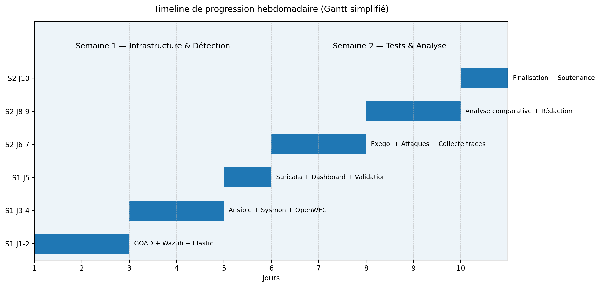
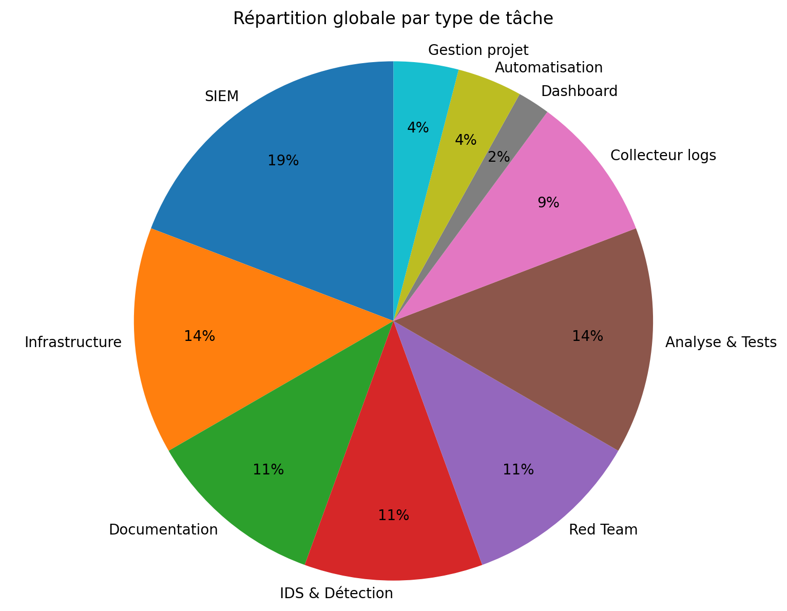
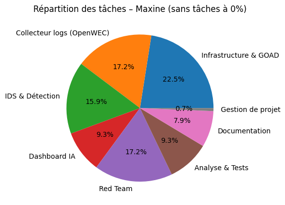
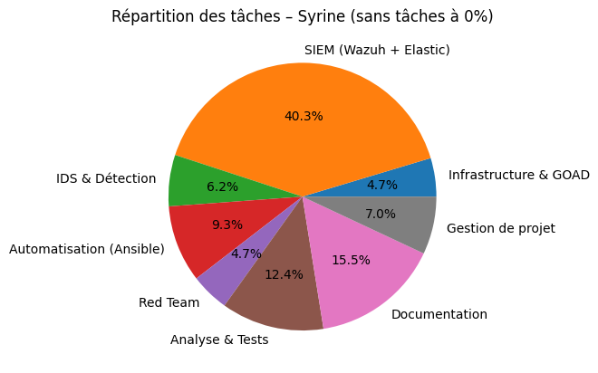

# GESTION DE PROJET - SAE 5C03 

**SAE:** Proof of Concept Blue Team / Red Team - Environnement GOAD  
**Équipe:**  Maxine Botturi et Syrine Benkadhi 

**Durée:** 10 jours (20/01/2026 - 30/01/2026)  

---

## 1. Introduction & Contexte

### Contexte du projet

Dans le cadre de la SAE 5C03 Cybersécurité, ce projet vise à déployer un environnement de détection d’intrusions combinant des approches Blue Team et Red Team. L’objectif est d’évaluer l’efficacité de plusieurs solutions de détection (SIEM, IDS, collecteurs de logs) face à différents scénarios d’attaque ciblant un Active Directory volontairement vulnérable.

### Objectifs et livrables

Notre projet vise à :
- Déployer l'environnement GOAD (5 machines Windows en domaine Active Directory)
- Mettre en œuvre Wazuh, Elastic, Suricata et OpenWEC
- Automatiser le déploiement des agents via Ansible
- Réaliser des tests d'intrusion documentés
- Analyser l'efficacité comparative des solutions de détection

Les livrables attendus comprennent une synthèse technique de 2 pages, des annexes techniques détaillées, un rapport de gestion de projet, un dépôt GitHub structuré, et une soutenance prévue le 30 janvier 2026 accompagné d'un diaporama.

### Organisation de l'équipe

Nous avons réparti le travail selon nos domaines de compétence tout en maintenant une collaboration étroite sur l'ensemble des tâches :

**Blue Team (Syrine) :**
- Wazuh (installation, configuration)
- Elastic Stack (installation, configuration)
- Déploiement des agents via Ansible (Wazuh et Elastic)
- Remontée des logs Sysmon sur Wazuh
- Exegol (installation via pipx)
- Analyse des alertes et détections
- Gestion de projet

**Red Team & Infrastructure (Maxine) :**
- Déploiement environnement GOAD
- OpenWEC et Suricata
- Configuration Sysmon
- Dashboard Streamlit avec IA
- Exegol (installation via pip et Docker)
- Tests d'intrusion et collecte de traces
- Analyse comparative des solutions

Cette répartition nous a permis de travailler en parallèle durant la phase d'installation (semaine 1) tout en collaborant pour l'analyse comparative (semaine 2).

---

## 2. Méthodologie appliquée

Nous avons mené le projet sur 2 phases d'une semaine chacune, adaptée aux contraintes de temps et à la taille de notre équipe.

| Phase | Période | Objectif principal | Durée |
|--------|---------|-------------------|-------|
| **Phase 1** | 20-24 janvier | Infrastructure & Détection | 5 jours |
| **Phase 2** | 27-30 janvier | Tests & Analyse | 4 jours |

### Organisation du travail

**Répartition des rôles :**

| Domaine | Syrine (Blue) | Maxine (Red + Infra) |
|---------|---------------|---------------------|
| **SIEM** | Wazuh, Elastic | - |
| **Collecteur logs** | - | OpenWEC |
| **IDS** | - | Suricata |
| **Monitoring** | Remontée logs Sysmon, Ansible | Configuration Sysmon |
| **Infrastructure** | - | GOAD (5 VMs) |
| **Attaque** | Exegol (pipx) | Exegol (pip/Docker), Tests intrusion |
| **Analyse** | Détections SIEM | Analyse comparative, Dashboard IA |
| **Gestion projet** | Rapport gestion de projet | - |

### Outils de gestion

| Outil | Usage | Avantages |
|-------|-------|-----------|
| **Trello** | Gestion des tâches (À faire → En cours → Terminé) | Visualisation claire de l'avancement |
| **GitHub** | Dépôt central (code, configs, docs, logs) | Traçabilité par commits, organisation structurée |
| **Réunions quotidiennes** | Synchronisation d'équipe et résolution de blocages | Réactivité face aux problèmes techniques |

### Découpage en phases

#### Phase 1 : Infrastructure & Détection (20-24 janvier)

**Objectif :** Environnement complet avec toutes les solutions opérationnelles

**Étapes importantes :**
-  Jour 1 (20/01) : GOAD déployé + Wazuh installé
-  Jour 2 (21/01) : Wazuh configuré + agents connectés
-  Jour 3 (22/01) : Ansible opérationnel + Elastic en cours
-  Jour 4 (23/01) : Suricata + procédures documentées
-  Jour 5 (24/01) : Validation infrastructure complète

#### Phase 2 : Tests & Analyse (27-30 janvier)

**Objectif :** Tests d'intrusion + analyse comparative + livrables finaux

**Étapes importantes :**
-  Jour 6 (27/01) : OpenWEC + Dashboard IA + Elastic finalisé + Suricata configuré
-  Jour 7 (28/01) : Exegol + premières attaques Kerberos + traces collectées
-  Jour 8 (29/01) : Analyse comparative en cours + rédaction
-  Jour 9 (30/01) : Finalisation synthèse + soutenance + réinitialisation matériel

---

## 3. Planification initiale

| Période | Nombre de jours | Heures par jour | Total par personne | Total équipe |
|---------|-----------------|-----------------|-------------------|--------------|
| Semaine 1 | 4j + 1j court | 4×7h30 + 1×3h45 | 33h45 | 67h30 |
| Semaine 2 | 4j + 1j court | 4×7h30 + 1×3h45 | 33h45 | 67h30 |
| **TOTAL** | **10 jours** | - | **67h30** | **135h** |

### Découpage des phases et tâches principales

#### Phase 1 : Infrastructure & Détection (Semaine 1)

| Tâche | Responsable | Estimation | Dépendances |
|-------|-------------|-----------|-------------|
| Initialisation repo GitHub + structure | Les deux | 2h | - |
| Schéma architecture réseau | Les deux | 3h | - |
| Déploiement GOAD (5 VMs Windows) | Maxine | 8h | Schéma réseau |
| Installation Wazuh | Syrine | 5h | - |
| Configuration Wazuh | Syrine | 6h | Installation Wazuh |
| Installation Elastic Stack | Syrine | 5h | - |
| Configuration Elastic | Syrine | 5h | Installation Elastic |
| Installation OpenWEC | Maxine | 7h | GOAD opérationnel |
| Configuration Sysmon | Maxine | 4h | GOAD opérationnel |
| Remontée logs Sysmon sur Wazuh | Syrine | 3h | Sysmon configuré |
| Playbooks Ansible agents | Syrine | 6h | Wazuh/Elastic installés |
| Installation Suricata | Maxine | 5h | - |
| Configuration Suricata + Sigma Rules | Maxine | 3h | Installation Suricata |
| Dashboard Streamlit IA | Maxine | 6h | OpenWEC opérationnel |

**Total estimé Phase 1 : ~68h**

#### Phase 2 : Tests & Analyse (Semaine 2)

| Tâche | Responsable | Estimation | Dépendances |
|-------|-------------|-----------|-------------|
| Installation Exegol | Les deux | 3h | - |
| Installation BloodHound/SharpHound | Maxine | 4h | Exegol |
| Cartographie AD | Maxine | 3h | BloodHound |
| Scénarios d'attaque (Kerberos, etc.) | Maxine | 8h | Cartographie AD |
| Collecte traces attaques | Les deux | 4h | Attaques lancées |
| Analyse alertes Wazuh | Syrine | 3h | Traces collectées |
| Analyse alertes Elastic | Maxine | 3h | Traces collectées |
| Analyse alertes Suricata | Maxine | 2h | Traces collectées |
| Analyse comparative solutions | Les deux | 5h | Toutes analyses faites |
| Rédaction synthèse technique | Les deux | 8h | Analyse terminée |
| Rédaction annexes techniques | Les deux | 6h | - |
| Préparation soutenance | Les deux | 3h | Synthèse finalisée |
| Réinitialisation matériel | Les deux | 1h | Après soutenance |

**Total estimé Phase 2 : ~53h**

### Etapes critiques

| Date | Etape | Critère de validation |
|------|-------|----------------------|
| **24/01** | Fin Phase 1 - Infrastructure complète | Tous les SIEM/IDS/collecteurs opérationnels avec agents déployés |
| **28/01** | Attaques réalisées + traces collectées | Au moins 3 scénarios d'attaque documentés avec logs |
| **29/01** | Analyse comparative terminée | Tableau comparatif d'efficacité finalisé |
| **30/01 matin** | Synthèse finale + annexes prêtes | Documents complets pour le rendu |
| **30/01 après-midi** | Soutenance + réinitialisation | Présentation effectuée + matériel nettoyé |

## 4. Bilan chiffré & Suivi du temps

### Temps de travail par personne

| Période | Syrine | Maxine | Total équipe |
|---------|--------|--------|---------------|
| **Semaine 1** (20-24 janvier) | 32h | 36h | 68h |
| **Semaine 2** (27-30 janvier) | 35h30 | 36h30 | 72h |
| **TOTAL PROJET** | **67h30** | **72h30** | **140h** |

### Répartition du temps par catégorie de tâches

| Catégorie | Syrine | Maxine | Total | % du projet |
|-----------|--------|--------|-------|-------------|
| **Infrastructure & GOAD** | 3h | 17h | 20h | 14% |
| **SIEM (Wazuh + Elastic)** | 26h | 0h | 26h | 19% |
| **Collecteur logs (OpenWEC)** | 0h | 13h | 13h | 9% |
| **IDS & Détection (Suricata, Sysmon)** | 4h | 12h | 16h | 11% |
| **Automatisation (Ansible)** | 6h | 0h | 6h | 4% |
| **Dashboard IA** | 0h | 7h | 7h | 5% |
| **Red Team (Exegol, attaques)** | 3h | 13h | 16h | 11% |
| **Analyse & Tests** | 8h | 7h | 15h | 11% |
| **Documentation** | 10h | 6h | 16h | 11% |
| **Gestion de projet** | 4h30 | 0h30 | 5h | 4% |
| **TOTAL** | **67h30** | **72h30** | **140h** | **100%** |

### Graphiques à créer pour le rendu

#### Graphique 1 : Timeline de progression hebdomadaire

#### Graphique 2 : Répartition globale par type de tâche

#### Graphique 3 : Répartition de taches par personne

## 5. Risques & Gestion

### Risques identifiés et gestion

| # | Risque | Impact | Probabilité | Statut | Actions menées |
|---|--------|--------|-------------|--------|----------------|
| **R1** | GOAD ne se déploie pas correctement | Critique | Moyenne | ✅ Géré | Suivi strict documentation Orange Cyberdefense, snapshots VMs réguliers, +2h de débogage |
| **R2** | Agents SIEM ne communiquent pas avec serveurs | Élevé | Élevée | ✅ Géré | Tests firewall Windows, validation config réseau, déploiement Ansible progressif |
| **R3** | Problèmes réseau entre GOAD et infrastructure salle | Élevé | Moyenne | ⚠️ Survenu | Reconfiguration réseau VirtualBox, tests connectivité, +3h perdues |
| **R4** | Retard déploiement Suricata | Moyen | Moyenne | ✅ Géré | Documentation en parallèle, tests de placement réseau optimisés |
| **R5** | Manque de temps pour analyse comparative | Moyen | Élevée | ⚠️ Partiellement | Priorisation 2-3 scénarios d'attaque clés (Kerberos principalement) |
| **R6** | Installation Elastic complexe | Moyen | Élevée | ⚠️ Survenu | Troubleshooting documenté (Windows/Debian), +3h supplémentaires |

### Problèmes rencontrés et solutions

**Problème 1 : Connectivité réseau GOAD ↔ Infrastructure**
- **Description :** Les VMs GOAD ne communiquaient pas correctement avec nos serveurs SIEM/IDS
- **Impact :** Retard de 3h sur déploiement agents
- **Solution appliquée :** Nous avons reconfiguré le mode réseau VirtualBox (bridge + NAT), validation ping/telnet systématique
- **Leçon apprise :** Valider l'architecture réseau complète avant de déployer les agents

**Problème 2 : Réinstallation de Elastic 4 fois**
- **Description :** Réinstallation Elasttic à cause d'un plantage de l'ordinateur.
- **Solution appliquée :** Nous avons mis en place une sécurisation de l'insttallation et déploiement via des snapchots
- **Leçon apprise :** Faire des snpchots à chaque nouvelle configuration

**Problème 3 : Compression du temps d'analyse**
- **Description :** Phase 1 plus longue que prévu, réduisant le temps disponible pour l'analyse comparative
- **Impact :** Limitation à 2 scénarios d'attaque au lieu de 5-6 prévus
- **Solution appliquée :** Nous avons focalisé sur les attaques Kerberos et Zerologon, collecte traces précise
- **Leçon apprise :** Prévoir une marge de sécurité de 20% sur les estimations

### Décisions d'ajustement prises

| Date | Décision | Justification | Impact |
|------|----------|---------------|--------|
| **22/01** | Ajout dashboard Streamlit IA pour OpenWEC | Valoriser le collecteur, faciliter analyse logs | +6h de dev mais gain en analyse |
| **24/01** | Report finalisation Elastic à semaine 2 | Prioriser infrastructure GOAD fonctionnelle | Réorganisation planning semaine 2 |
| **27/01** | Priorisation attaques simple et une complexe | Manque de temps pour scénarios multiples | Focus qualité > quantité |
| **28/01** | Répartition rédaction synthèse 50/50 | Deadline  30/01 | Parallélisation rédaction |

### Gestion des imprévus

**Stratégies que nous avons appliquées :**
- **Communication quotidienne** : Point rapide chaque matin pour identifier blocages
- **Priorisation dynamique** : Ajustement Trello en temps réel selon contraintes
- **Documentation continue** : Rédaction procédures au fur et à mesure pour gagner du temps semaine 2
- **Entraide technique** : Nous nous sommes dépannées mutuellement sur les blocages

**Outils de mitigation :**
- Snapshots des VMs 
- Scripts de déploiement versionnés sur Git
- Documentation troubleshooting centralisée dans DOCS/04_troubleshooting/

---

## 6. Rétrospective : Win/Fail & Leçons apprises

### Ce qui a bien fonctionné (Wins) 🎉

| Aspect | Description | Impact positif |
|--------|-------------|----------------|
| **Organisation GitHub** | Structure de dossiers claire dès le départ (DOCS, CONFIGS, AUTOMATION, LOGS) | Gain de temps énorme, pas de perte de fichiers, collaboration fluide |
| **Répartition Blue/Red Team** | Séparation des rôles claire : Syrine (détection) / Maxine (infra + attaque) | Travail en parallèle efficace semaine 1, expertise ciblée |
| **Automatisation Ansible** | Déploiement agents Wazuh et Elastic automatisé sur toutes les VMs | Reproductibilité, gain de temps, moins d'erreurs manuelles |
| **GOAD déployé rapidement** | Environnement AD vulnérable opérationnel en 1 jour | Respect du planning, base solide pour la suite |
| **Documentation continue** | Procédures rédigées au fur et à mesure des installations | Pas de stress en fin de projet, annexes prêtes |
| **Dashboard Streamlit IA** | Innovation non prévue initialement pour valoriser OpenWEC | Différenciation du projet, démo visuelle impressionnante |
| **Gestion Trello efficace** | Kanban simple et clair, mis à jour régulièrement | Vision d'avancement partagée, pas de tâches oubliées |
| **Communication quotidienne** | Points rapides chaque matin au labo | Résolution rapide des blocages, entraide technique |
| **Collaboration étroite** | Travail réellement ensemble sur l'ensemble du projet | Complémentarité des compétences, entraide constante |

### Ce qui n'a pas fonctionné (Fails) ❌

| Aspect | Description | Impact négatif | Amélioration possible |
|--------|-------------|----------------|----------------------|
| **Déploiement OpenWEC conteneurisé avec TLS** | Configuration des certificats TLS pour la communication sécurisée entre OpenWEC et les endpoints Windows. Erreurs de trust chain et problèmes de GPO pour le déploiement automatique des certificats | Perte de 8-10h de debug, stress technique, solution finale = déploiement manuel sur chaque VM au lieu de l'automatisation prévue | Tester la stack de certificats en environnement isolé d'abord. Documenter les prérequis AD (CA, GPO) avant de conteneuriser. Prévoir un plan B (installation native) dès le début du projet |
| **Tuning initial Elastic Stack** | Sous-estimation du temps nécessaire pour configurer les pipelines Logstash, les index patterns et les règles de parsing | Semaine 1 déborde de 6h sur le planning initial, corrélation d'événements retardée, ajustements faits pendant la semaine 2 | Allouer 15h au lieu de 9h pour Elastic dans le planning initial. Commencer par des templates Logstash existants avant de customiser. Tester les pipelines avec des données de test avant la prod |
| **Volume de faux positifs OpenWEC** | OpenWEC génère énormément d'événements 4624/4625/4769 légitimes (authentifications normales, tickets Kerberos standards), difficile de filtrer efficacement au début | 14h d'analyse des logs pour ajuster les règles de filtrage, fatigue de detection, risque de manquer de vraies alertes noyées dans le bruit | Créer des whitelist/blacklist dès la phase de déploiement. S'inspirer de règles Sigma existantes pour AD. Établir une baseline de comportement normal avant les tests |
| **Complexité dashboard IA Streamlit** | Scope initial du dashboard trop ambitieux (16h prévues pour un système complet de corrélation IA), pas réaliste pour un POC de 2 semaines | Risque de déséquilibre du travail entre Syrine et Maxine, abandon du dashboard complet au profit d'une version simplifiée | ✅ **Déjà corrigé** : adaptation en cours de route avec installation basique (3h). Leçon : toujours valider le scope avec l'encadrant avant de se lancer dans du développement complexe |
| **Manque de tests de charge** | Pas de simulation d'attaques massives ou de trafic réseau important pour tester la scalabilité des outils de détection | On ne connaît pas les limites de notre stack en environnement de production réel, pas de métriques de performance sous charge | Prévoir une journée dédiée au stress test : simulation de 1000 événements/min, attaques simultanées multiples, saturation volontaire des logs pour voir les limites |
| **Documentation des règles de détection** | Les règles Wazuh/Elastic/Suricata ont été créées "on the fly" pendant les tests sans documentation claire de la logique métier derrière chaque règle | Difficile de reproduire ou d'expliquer pourquoi telle règle détecte telle attaque, maintenance compliquée, transfert de connaissances limité | Documenter chaque règle dans un fichier YAML/JSON avec : objectif, pattern recherché, seuils utilisés, justification technique, exemples de détection |
| **Pas de baseline de comportement normal** | On a lancé les attaques directement sans établir une baseline de trafic "normal" sur GOAD pendant 24-48h | Difficile de distinguer le bruit de fond des vraies attaques, surtout pour Suricata qui génère beaucoup d'alertes réseau légitimes | Faire tourner GOAD 24-48h sans attaque pour capturer le comportement normal (authentifications, réplication AD, DNS, etc.), puis utiliser ça comme référence pour le tuning |

---

## Leçons apprises 📚

### Techniques
- **Certificats TLS en environnement AD = complexité sous-estimée** : Toujours tester la PKI (Public Key Infrastructure) et les trust chains en environnement isolé avant le déploiement production
- **OpenWEC = puissant mais verbeux** : Nécessite un filtrage agressif et des règles de corrélation dès le départ, sinon on se noie sous les événements Windows
- **Elastic Stack = flexible mais courbe d'apprentissage raide** : Prévoir 50% de temps en plus pour le tuning des règles, des pipelines Logstash et de l'indexation
- **La détection est un processus itératif** : Impossible d'avoir des règles parfaites du premier coup, il faut ajuster en continu en fonction des faux positifs/négatifs

### Gestion de projet
- **S'adapter > s'obstiner** : Nous avons bien fait de réduire le scope du dashboard IA (16h → 3h) plutôt que de perdre du temps sur une feature non critique pour le POC
- **Communication quotidienne = clé du succès** : Les points rapides chaque matin nous ont évité beaucoup de blocages techniques et ont permis une résolution rapide des problèmes
- **Planifier des buffers techniques** : Nous aurions dû prévoir 10-15% de temps tampon dans le planning pour les imprévus (certificats, tuning, compatibilité, etc.)
- **Valider le scope régulièrement** : Revoir les objectifs avec l'encadrant chaque semaine pour éviter de partir dans des directions trop ambitieuses

### Collaboration
- **Blue Team + Red Team = complémentarité parfaite** : Maxine qui lance les attaques en temps réel pendant que Syrine observe les détections = approche très efficace et réaliste
- **Structure GitHub claire dès J1 = gain de temps énorme** : Pas de perte de fichiers, pas de chaos en fin de projet, collaboration fluide tout au long du projet
- **Trello simple et bien utilisé > outil complexe abandonné** : Un Kanban basique mais mis à jour quotidiennement est plus efficace qu'un outil ultra-sophistiqué jamais consulté
- **Documentation continue > documentation de fin** : Rédiger les procédures au fur et à mesure évite le stress de dernière minute et garantit la qualité des livrables

---

## 7. Conclusion

Notre projet nous a permis de déployer avec succès un environnement de détection complet (GOAD + Wazuh + Elastic + OpenWEC + Suricata) et d'analyser son efficacité face à des attaques réelles. 

La méthodologie que nous avons appliquée, combinée à une répartition claire des rôles, une bonne collaboration et à l'automatisation via Ansible, nous a permis de respecter la deadline  malgré un planning serré et des imprévus techniques.

Au-delà des compétences techniques en cybersécurité que nous avons développées, ce projet a renforcé nos capacités en gestion de projet, priorisation et adaptation face aux contraintes. La principale leçon que nous retenons est l'importance de prévoir des marges sur les estimations et de documenter en continu plutôt qu'à posteriori.

---

